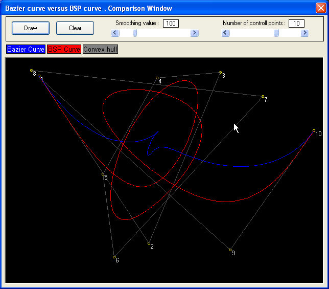



## Generating and Animating  Bezier, BSPline, Nurbs Curves, with Antialiasing enabled \!\!\!

### Description

This code demonstrated the following:

Generating a Bezier Curve

Generating a BSPLine / Nurbs curve

Comparison with both curves

Affine 2D transformations (such as rotation, translation, scaling).

Affine 3D transformation

Fractal Coastline generator

3D transformation Demo
 
### More Info
 
You can control if it will be Anti-aliased or not, the smoothness of curves, the number of control points to generate the curve etc..

This includes a GraphiX library and a transformation library.

It shows you how to draw a multi power Classic Bezier and Bspline curves. This means you can approximate the routines very easly to generate a Cubic or Quadratic Bezier curve!

             |
---                |---
**Submitted On**   |2004-08-31 15:22:56
**By**             |[Hari Krishnan](https://github.com/Planet-Source-Code/PSCIndex/blob/master/ByAuthor/hari-krishnan.md)
**Level**          |Intermediate
**User Rating**    |4.9 (64 globes from 13 users)
**Compatibility**  |VB 6\.0
**Category**       |[Graphics](https://github.com/Planet-Source-Code/PSCIndex/blob/master/ByCategory/graphics__1-46.md)
**World**          |[Visual Basic](https://github.com/Planet-Source-Code/PSCIndex/blob/master/ByWorld/visual-basic.md)
**Archive File**   |[Generating1792419122004\.zip](https://github.com/Planet-Source-Code/hari-krishnan-generating-and-animating-bezier-bspline-nurbs-curves-with-antialiasing-enabl__1-56137/archive/master.zip)

